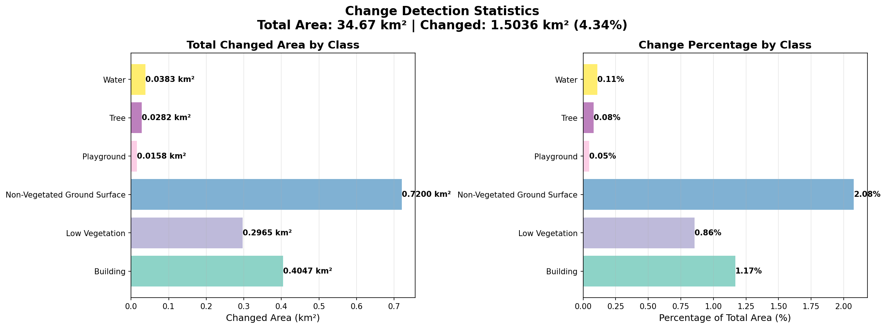

# Rapport de cas d'usage — Détection de changements sur le Village Olympique de Saint-Denis

**Modèle :** RCDNet (VMamba + CLIP)
**Zone :** Village Olympique, Saint-Denis (93)
**Période :** 2021 → 2024
**Données :** IGN Géoplateforme — ORTHOPHOTOS2021 + ORTHO-EXPRESS.2024

---

## 1. Contexte

L'IGN Géoplateforme met à disposition, via des services WMS publics, des orthophotos aériennes à très haute résolution couvrant l'ensemble du territoire national. Ces images peuvent atteindre 20 cm/pixel selon le millésime et la zone. Nous nous sommes limités à **0,5 m/pixel**, résolution à laquelle le modèle RCDNet a été pré-entraîné (jeu de données SECOND), afin de minimiser le décalage de domaine. À titre de comparaison, Sentinel-2 — couramment utilisé dans ce domaine — fournit des images RGB à 10 m/pixel, soit une résolution 20 fois plus grossière.

Le Village Olympique de Saint-Denis constitue un terrain d'application particulièrement pertinent : entre 2021 et 2024, ce site de 52 hectares a subi une transformation urbaine majeure — démolition d'entrepôts, construction de logements, création d'espaces verts et d'équipements sportifs — avant d'accueillir plus de 14 500 athlètes lors des Jeux Olympiques de Paris 2024.

L'objectif de ce cas d'usage est de démontrer la capacité de RCDNet à détecter et qualifier automatiquement ces changements à l'échelle de la classe sémantique (bâtiment, végétation, sol nu, etc.), sans annotation manuelle de la zone cible.

---

## 2. Approche

RCDNet est un modèle de détection de changements par référence linguistique (*referring change detection*). Contrairement aux approches binaires classiques (changé / non changé), il produit des **masques de changement sémantiques** en interrogeant le modèle classe par classe via un prompt textuel.

**Architecture :**
- **Encodeur visuel :** VMamba (Visual State Space Model), traité en mode Siamois sur les images avant/après
- **Encodeur textuel :** CLIP, qui encode le nom de chaque classe sémantique
- **Décodeur :** MambaDecoder avec attention croisée texte-image
- **Inférence :** pour chaque classe *c*, le modèle prédit les pixels ayant changé *vers* ou *depuis* cette classe

**Entraînement :** le modèle a été entraîné sur le jeu de données SECOND (imagerie aérienne urbaine, résolution compatible avec les orthophotos IGN), sans aucune donnée de la zone d'étude.

**Inférence zero-shot :** aucune annotation manuelle de Saint-Denis n'a été nécessaire. Les 6 classes du jeu de données SECOND ont été appliquées directement à la zone cible.

---

## 3. Données

| Paramètre | Valeur |
|---|---|
| Source avant (A) | IGN — ORTHOPHOTOS2021 |
| Source après (B) | IGN — ORTHO-EXPRESS.2024 |
| Résolution spatiale | 0,5 m/pixel |
| Système de coordonnées | EPSG:2154 (Lambert-93) |
| Zone couverte | 34,67 km² autour de Saint-Denis |
| Taille des tuiles | 512 × 512 pixels |
| Nombre de paires | 529 |
| Accès | Service WMS public IGN Géoplateforme |

Les orthophotos ont été téléchargées automatiquement via le service WMS de la Géoplateforme IGN, puis découpées en tuiles de 512 × 512 pixels avant inférence.

---

## 4. Résultats

*Figure 1 : Grille de détection multi-classes. Chaque ligne correspond à une paire de tuiles (avant / après / masque de changement superposé).*

### 4.1 Résultats quantitatifs

| Classe sémantique | Surface modifiée (km²) | % de la zone totale |
|---|---|---|
| Sol non végétalisé | 0,720 | 2,08 % |
| Bâtiment | 0,405 | 1,17 % |
| Végétation basse | 0,297 | 0,86 % |
| Eau | 0,038 | 0,11 % |
| Arbre | 0,028 | 0,08 % |
| Terrain de jeux | 0,016 | 0,05 % |
| **Total** | **1,503 km²** | **4,34 %** |

**Couverture totale :** 529 paires · 34,67 km² · 1 450 masques de changement générés

*Figure 2 : Répartition surfacique des changements par classe sémantique.*

### 4.2 Interprétation

La classe **sol non végétalisé** domine les changements (2,08 %), ce qui est cohérent avec les phases de terrassement et de préparation des terrains observées entre 2021 et 2024. La classe **bâtiment** (1,17 %) reflète la construction des immeubles de logements du Village Olympique. La progression de la **végétation basse** (0,86 %) traduit la création d'espaces verts et de jardins sur le site.

Ces résultats sont qualitativement cohérents avec la transformation visible du site entre 2021 et 2024.

---

## 5. Points techniques

### 5.1 Adaptation à la résolution IGN

Le modèle a été entraîné sur SECOND (imagerie aérienne à résolution comparable). L'application directe aux orthophotos IGN (0,5 m/pixel) s'est avérée possible sans réentraînement, confirmant la généralisation du modèle à des données à haute résolution.

### 5.2 Problèmes résolus

**Chunked attention (mémoire GPU) :** L'inférence sur tuiles 512×512 avec le décodeur MambaDecoder provoquait des pics mémoire dépassant la capacité GPU disponible. Le mécanisme d'attention du décodeur a été modifié pour traiter les requêtes par blocs (*chunked attention*) plutôt qu'en une seule matrice O(N²), ce qui a permis de faire passer l'inférence complète sans dégradation de qualité.

**Normalisation SECOND :** Les statistiques de normalisation du jeu d'entraînement SECOND (moyenne et écart-type par canal) ont été appliquées directement aux orthophotos IGN. Un écart de distribution colorimétrique subsiste (orthophotos IGN légèrement plus saturées), mais il n'a pas empêché une détection qualitativement correcte.

**Alignement temporel :** Les deux millésimes d'orthophotos (2021 et 2024) sont tous deux géoréférencés en Lambert-93 via le service WMS IGN. Les tuiles A et B étant téléchargées sur la même bbox exacte au pixel près, l'alignement géométrique est assuré par le WMS lui-même, sans recalage supplémentaire.

La procédure complète de débogage est documentée dans [`docs/IGN_INFERENCE_TROUBLESHOOTING.md`](IGN_INFERENCE_TROUBLESHOOTING.md).

---

## 6. Pertinence pour les missions IGN

Ce travail s'inscrit directement dans plusieurs axes stratégiques de l'IGN :

**OCS GE (Occupation du Sol à Grande Échelle) :** La détection automatique de changements sémantiques à 0,5 m/pixel est complémentaire de la mise à jour de la base OCS GE, qui requiert actuellement une interprétation visuelle manuelle coûteuse. RCDNet produit des propositions de changement par classe, utilisables comme aide à la photo-interprétation ou comme signal d'alerte pour les zones à re-cartographier en priorité.

**Suivi du territoire :** La capacité à détecter des changements entre deux millésimes d'orthophotos, sans annotation de la zone cible, permet d'envisager un suivi continu et automatisé à l'échelle nationale, cohérent avec la fréquence de renouvellement des prises de vue IGN.

**Exploitation de la Géoplateforme :** Ce cas d'usage démontre la faisabilité d'une chaîne de traitement entièrement basée sur les services WMS publics de la Géoplateforme IGN, sans acquisition de données tierces.

**Transfert vers d'autres zones :** La même chaîne de traitement peut être appliquée à n'importe quelle zone couverte par les orthophotos IGN sans modification, ce qui ouvre la voie à des applications à grande échelle (zones périurbaines, suivi post-catastrophe, artificialisation des sols).

---

## 7. Référence

Ce travail s'appuie sur l'architecture RCDNet, elle-même fondée sur :
- **VMamba** — Visual State Space Models (backbone)
- **Sigma** — Siamese Mamba Network for Multi-Modal Semantic Segmentation
- **SECOND dataset** — Semantic Change Detection dataset (entraînement)

Pour reproduire ces résultats : voir [`showcase/README.md`](../showcase/README.md).
